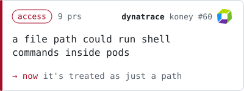
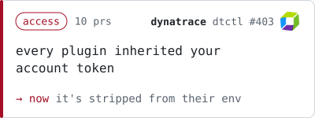
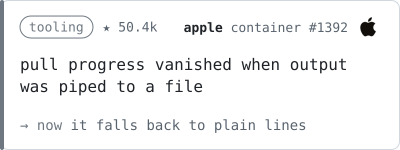
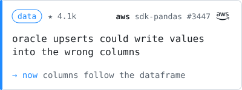
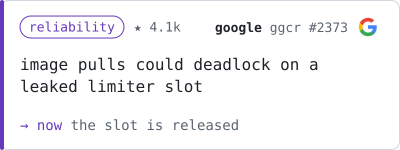
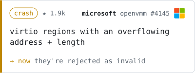
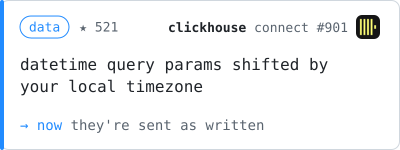
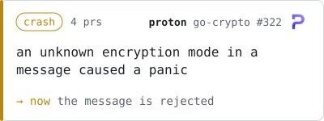

### Kirill Novikov

<a href="https://github.com/search?q=is%3Apr+author%3AknQzx+is%3Amerged+-user%3AknQzx+merged%3A%3E%3D2026-03-01&type=pullrequests">all merged prs</a> · <a href="https://www.linkedin.com/in/knqzx/">linkedin</a> · <a href="https://t.me/knQzx">telegram</a> · klagenfurt, austria

<a href="https://github.com/search?q=is%3Apr+author%3AknQzx+is%3Amerged+-user%3AknQzx+merged%3A%3E%3D2026-03-01&type=pullrequests"><picture>
  <source media="(prefers-color-scheme: dark)" srcset="./hero-dark.svg">
  
</picture></a>

i read other people's infrastructure code and fix the bugs that crash it, leak data or let the wrong people in. 27 of these went to dynatrace's open source repos, the rest to clickhouse, kubernetes, google, microsoft and others

<picture>
  <source media="(prefers-color-scheme: dark)" srcset="./strip-dark.svg">
  
</picture>

a few of them:

<a href="https://github.com/dynatrace-oss/koney/pull/60"><picture><source media="(prefers-color-scheme: dark)" srcset="./cards/koney-60-dark.svg"></picture></a> <a href="https://github.com/dynatrace-oss/dtctl/pull/403"><picture><source media="(prefers-color-scheme: dark)" srcset="./cards/dtctl-403-dark.svg"></picture></a>
<a href="https://github.com/apple/container/pull/1392"><picture><source media="(prefers-color-scheme: dark)" srcset="./cards/container-1392-dark.svg"></picture></a> <a href="https://github.com/aws/aws-sdk-pandas/pull/3447"><picture><source media="(prefers-color-scheme: dark)" srcset="./cards/pandas-3447-dark.svg"></picture></a>
<a href="https://github.com/google/go-containerregistry/pull/2373"><picture><source media="(prefers-color-scheme: dark)" srcset="./cards/ggcr-2373-dark.svg"></picture></a> <a href="https://github.com/microsoft/openvmm/pull/4145"><picture><source media="(prefers-color-scheme: dark)" srcset="./cards/openvmm-4145-dark.svg"></picture></a>
<a href="https://github.com/ClickHouse/clickhouse-connect/pull/901"><picture><source media="(prefers-color-scheme: dark)" srcset="./cards/chconnect-901-dark.svg"></picture></a> <a href="https://github.com/ProtonMail/go-crypto/pull/322"><picture><source media="(prefers-color-scheme: dark)" srcset="./cards/gocrypto-322-dark.svg"></picture></a>

all 75, by type

 

**crashes** (11)

- [dynatrace-oss/koney#65](https://github.com/dynatrace-oss/koney/pull/65) fix: do not panic when a trap annotation does not match the resource type
- [paulscherrerinstitute/scilog#680](https://github.com/paulscherrerinstitute/scilog/pull/680) fix(api): guard websocket message parsing and default config
- [ProtonMail/go-crypto#325](https://github.com/ProtonMail/go-crypto/pull/325) restrict embedding to embeddable signature types
- [ProtonMail/go-crypto#322](https://github.com/ProtonMail/go-crypto/pull/322) Don't panic on unknown AEAD mode in v5/v6 SKESK packets
- [ProtonMail/go-crypto#319](https://github.com/ProtonMail/go-crypto/pull/319) guard nil issuer key id on v2 message read path
- [ProtonMail/go-crypto#320](https://github.com/ProtonMail/go-crypto/pull/320) guard nil issuer key id when checking trailing signature
- [dynatrace-oss/dtctl#404](https://github.com/dynatrace-oss/dtctl/pull/404) fix: don't panic when .content.content is not an object
- [microsoft/openvmm#4145](https://github.com/microsoft/openvmm/pull/4145) virtio: reject regions whose address and length overflow
- [dynatrace-oss/koney#61](https://github.com/dynatrace-oss/koney/pull/61) fix: do not panic when a trap matches resources by namespace only
- [NVIDIA/NeMo-Agent-Toolkit#2135](https://github.com/NVIDIA/NeMo-Agent-Toolkit/pull/2135) fix(core): guard bare generic type args in recursive_componentref_discovery
- [dynatrace-oss/terraform-provider-dynatrace#1183](https://github.com/dynatrace-oss/terraform-provider-dynatrace/pull/1183) fix: avoid panic parsing array-shaped REST error bodies

**access & secrets** (13)

- [dynatrace-oss/koney#72](https://github.com/dynatrace-oss/koney/pull/72) fix: authenticate the callers of the alert forwarder webhooks
- [platformio/platformio-core#5499](https://github.com/platformio/platformio-core/pull/5499) prevent path traversal via chmod and mtime in zip unpacking
- [SciCatProject/backend#2888](https://github.com/SciCatProject/backend/pull/2888) fix: authorize target dataset when creating/updating datablocks
- [SciCatProject/backend#2886](https://github.com/SciCatProject/backend/pull/2886) fix: add access filter and status guard to v3 publisheddata operations
- [SciCatProject/backend#2885](https://github.com/SciCatProject/backend/pull/2885) fix: apply access filter to samples findOne
- [SciCatProject/backend#2884](https://github.com/SciCatProject/backend/pull/2884) fix: enforce dataset permissions on v3 publisheddata register
- [SciCatProject/backend#2887](https://github.com/SciCatProject/backend/pull/2887) fix: check dataset read permission in publisheddata formpopulate
- [dynatrace-oss/dtctl#403](https://github.com/dynatrace-oss/dtctl/pull/403) fix: strip the account token from a plugin's environment
- [dynatrace-oss/dtmgd#27](https://github.com/dynatrace-oss/dtmgd/pull/27) fix: stop writing expanded env vars back into the config
- [dynatrace-oss/koney#60](https://github.com/dynatrace-oss/koney/pull/60) fix: prevent command injection through FilesystemHoneytoken file paths
- [neuroinformatics-unit/datashuttle#717](https://github.com/neuroinformatics-unit/datashuttle/pull/717) clear password from TUI input after use
- [bitpanda-labs/bitpanda-mcp#57](https://github.com/bitpanda-labs/bitpanda-mcp/pull/57) fix: bind env api key only in stdio transport mode
- [LayerPay-org/backend-v2#2](https://github.com/LayerPay-org/backend-v2/pull/2) add brute force protection and rate limiting

**reliability** (12)

- [Dynatrace/dynatrace-operator#6533](https://github.com/Dynatrace/dynatrace-operator/pull/6533) fix: return error from installAgentFromImage when extraction fails
- [dynatrace-oss/koney#67](https://github.com/dynatrace-oss/koney/pull/67) fix: keep the honeytoken secret when other deployments still mount it
- [dynatrace-oss/koney#66](https://github.com/dynatrace-oss/koney/pull/66) fix: skip resources with unparsable trap annotations instead of failing
- [getsentry/sentry-go#1387](https://github.com/getsentry/sentry-go/pull/1387) fix: keep http.Hijacker when wrapping a response writer
- [paulscherrerinstitute/scilog#678](https://github.com/paulscherrerinstitute/scilog/pull/678) fix(api): await restoreDeletedId in snippet controllers
- [dynatrace-oss/koney#62](https://github.com/dynatrace-oss/koney/pull/62) fix: react to label changes on pods again
- [dynatrace-oss/dtctl#399](https://github.com/dynatrace-oss/dtctl/pull/399) fix: report CSV write errors instead of dropping them
- [dynatrace-oss/dtctl#398](https://github.com/dynatrace-oss/dtctl/pull/398) fix: rewind multipart bodies before a retry
- [google/go-containerregistry#2373](https://github.com/google/go-containerregistry/pull/2373) remote: release pull limiter slot when body is read to EOF
- [kubernetes/git-sync#980](https://github.com/kubernetes/git-sync/pull/980) add --init-period and --init-max-failures flags
- [aws/aws-sdk-pandas#3294](https://github.com/aws/aws-sdk-pandas/pull/3294) fix(iceberg): too many open partitions by sorting inserts
- [anza-xyz/agave#11760](https://github.com/anza-xyz/agave/pull/11760) fix toctou in program statistics merge_from

**wrong data** (24)

- [aws/aws-sdk-pandas#3447](https://github.com/aws/aws-sdk-pandas/pull/3447) fix: align oracle upsert placeholders with dataframe column order
- [google/osv-scalibr#2313](https://github.com/google/osv-scalibr/pull/2313) fix(sbom): strip platform suffix from RubyGems versions in CycloneDX
- [dynatrace-oss/koney#71](https://github.com/dynatrace-oss/koney/pull/71) fix: honor matchExpressions in resource selectors
- [ClickHouse/mcp-clickhouse#210](https://github.com/ClickHouse/mcp-clickhouse/pull/210) stringify integers outside JavaScript's safe range in JSON results
- [anexia/go-anxsdk#1](https://github.com/anexia/go-anxsdk/pull/1) fix resource tags endpoint dropping the identifier
- [speechbrain/speechbrain#3043](https://github.com/speechbrain/speechbrain/pull/3043) fix float columns being converted to string in from_csv
- [dynatrace-oss/eBPF-Discovery#130](https://github.com/dynatrace-oss/eBPF-Discovery/pull/130) accept colon and double quote in header values
- [NVIDIA/NeMo-Agent-Toolkit#2141](https://github.com/NVIDIA/NeMo-Agent-Toolkit/pull/2141) fix: do not forward the unknown-model sentinel as a per-request model override
- [dynatrace-oss/dtctl#405](https://github.com/dynatrace-oss/dtctl/pull/405) fix: paginate direct shares so unshare --all sees every page
- [dynatrace-oss/hash4j#637](https://github.com/dynatrace-oss/hash4j/pull/637) fix deduplicateTokens for ranges not starting at the beginning
- [ClickHouse/clickhouse-connect#901](https://github.com/ClickHouse/clickhouse-connect/pull/901) fix: do not shift naive datetime query parameters by the host timezone
- [microsoft/openvmm#4144](https://github.com/microsoft/openvmm/pull/4144) openhcl_boot: derive the hw id chunk size from the page size
- [dynatrace-oss/koney#63](https://github.com/dynatrace-oss/koney/pull/63) fix: identify matched workloads by namespace and name
- [dynatrace-oss/dtctl#387](https://github.com/dynatrace-oss/dtctl/pull/387) fix: read direct shares from the correct API response key
- [Dynatrace/dynatrace-otel-collector#1110](https://github.com/Dynatrace/dynatrace-otel-collector/pull/1110) fix: escape the word boundary in the IPv4 redaction example
- [dynatrace-oss/dtctl#366](https://github.com/dynatrace-oss/dtctl/pull/366) fix(query): surface Grail metadata in the agent envelope
- [dynatrace-oss/dtctl#365](https://github.com/dynatrace-oss/dtctl/pull/365) fix(config): normalize environment URL scheme on context creation
- [Dynatrace/dynatrace-operator#6536](https://github.com/Dynatrace/dynatrace-operator/pull/6536) fix: preserve TelemetryIngest spec in v1beta5 ConvertFrom
- [stripe/stripe-cli#1549](https://github.com/stripe/stripe-cli/pull/1549) fix fixture path losing suffix after dynamic ID substitution
- [ton-blockchain/ton#2278](https://github.com/ton-blockchain/ton/pull/2278) fix wrong getoriginalfwdfee formula in docs
- [ClickHouse/mcp-clickhouse#154](https://github.com/ClickHouse/mcp-clickhouse/pull/154) return json strings from query results instead of dicts
- [stripe/stripe-cli#1534](https://github.com/stripe/stripe-cli/pull/1534) fix skip-verify not applying to thin event forwarding
- [ga4gh/vrs-python#621](https://github.com/ga4gh/vrs-python/pull/621) Fix copies=0 producing wrong VRS object type
- [platformio/platformio-core#5412](https://github.com/platformio/platformio-core/pull/5412) fix integrity.dat not being cleaned on version string typo

**tooling** (15)

- [ethereum/execution-specs#3191](https://github.com/ethereum/execution-specs/pull/3191) chore(ci): deduplicate temp-dir creation across Justfile recipes
- [microsoft/openvmm#3975](https://github.com/microsoft/openvmm/pull/3975) underhill_core: capture additional meminfo/status fields for OOM diagnosis
- [dynatrace-oss/ai-config-manager#17](https://github.com/dynatrace-oss/ai-config-manager/pull/17) fix(resource): improve YAML mapping-error suggestion for nested permissions (#12)
- [neuroinformatics-unit/datashuttle#716](https://github.com/neuroinformatics-unit/datashuttle/pull/716) replace bare except clauses with except Exception
- [neuroinformatics-unit/datashuttle#715](https://github.com/neuroinformatics-unit/datashuttle/pull/715) remove duplicate fancylog dependency
- [dynatrace-oss/dtctl#202](https://github.com/dynatrace-oss/dtctl/pull/202) feat: expose Document API filter/sort/add-fields/admin-access flags
- [mostly-ai/mostlyai-mock#130](https://github.com/mostly-ai/mostlyai-mock/pull/130) feat: add api_base parameter for OpenAI-compatible endpoints
- [dynatrace-oss/dtctl#198](https://github.com/dynatrace-oss/dtctl/pull/198) fix: doctor warns instead of fails on platform tokens (#190)
- [apple/container#1418](https://github.com/apple/container/pull/1418) improve error message when image save platform is not available
- [apple/container#1392](https://github.com/apple/container/pull/1392) Fall back to simple text output when stdout is not a TTY
- [OpenZeppelin/stellar-contracts#680](https://github.com/OpenZeppelin/stellar-contracts/pull/680) add stellar metadata section to contract cargo.toml files
- [LayerPay-org/backend-v2#1](https://github.com/LayerPay-org/backend-v2/pull/1) integrate blockchain listeners for solana, ethereum, bsc
- [ethereum/execution-specs#2621](https://github.com/ethereum/execution-specs/pull/2621) feat(ci,tooling): add vulture dead code detection to just & ci
- [ga4gh/vrs-python#619](https://github.com/ga4gh/vrs-python/pull/619) build!: Split dev deps into dev, tests, lint, docs groups
- [xonsh/xonsh#6181](https://github.com/xonsh/xonsh/pull/6181) feat(Xontrib): Show xontrib description in `xontrib list` output

